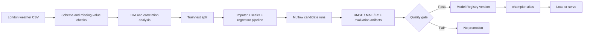

# London Temperature Intelligence with MLflow

### End-to-End Regression, Experiment Tracking, Model Governance, and Serving


An end-to-end machine-learning and MLOps project that estimates London's daily mean temperature from historical weather measurements. The project combines exploratory analysis, leak-free preprocessing, regression-model comparison, experiment tracking, artifact packaging, Model Registry governance, and local REST serving.

> This repository is an educational portfolio project. It estimates same-day mean temperature from related daily measurements; it is not yet a validated future-weather forecasting system.

## Project objectives

- Inspect and clean 42 years of London weather data.
- Identify variables that are strongly associated with mean temperature.
- Compare linear regression, decision trees, and random forests.
- Track reproducible experiments with MLflow.
- Package preprocessing and estimation as one portable model.
- Select a candidate through explicit technical criteria.
- Register an immutable model version and assign a `champion` alias.
- Document limitations, inference contracts, and next steps.

## Dataset

`london_weather.csv` contains 15,341 daily records from 1979-01-01 through 2020-12-31.

| Column | Meaning | Unit |
|---|---|---|
| `date` | Measurement date | `YYYYMMDD` |
| `cloud_cover` | Cloud cover | oktas |
| `sunshine` | Sunshine duration | hours |
| `global_radiation` | Irradiance | W/m² |
| `max_temp` | Daily maximum temperature | °C |
| `mean_temp` | Daily mean temperature (target) | °C |
| `min_temp` | Daily minimum temperature | °C |
| `precipitation` | Precipitation | mm |
| `pressure` | Atmospheric pressure | Pa |
| `snow_depth` | Snow depth | cm |

The compact modeling feature set is:

```text
min_temp + max_temp + global_radiation -> mean_temp
```

## Workflow



## Main results

The reproducible baseline experiment uses a fixed random 80/20 split.

| Model/configuration | Test RMSE |
|---|---:|
| Linear regression | 0.898 °C |
| Decision tree, depth 1 | 3.407 °C |
| Decision tree, depth 2 | 2.329 °C |
| Decision tree, depth 10 | 1.021 °C |
| Random forest, depth 1 | 3.280 °C |
| Random forest, depth 2 | 2.224 °C |
| Random forest, depth 10 | **0.894 °C** |

The random forest provides the smallest test RMSE, but its improvement over linear regression is only about 0.4%. This is an important interpretation: the simplest model remains competitive and would be a reasonable operational baseline.

## MLflow evidence logged

Every production-candidate run records:

- model and preprocessing parameters;
- RMSE, MAE, and R²;
- searchable lifecycle and ownership tags;
- training dataset source, schema, and target;
- the complete scikit-learn pipeline;
- model signature and raw input example;
- row-level test predictions;
- residual analysis plot;
- feature importance or absolute coefficients;
- a structured limitations file.

The best candidate must pass both conditions before registration:

```text
RMSE <= 1.0 °C
R²   >= 0.97
```

An approved artifact is registered as `LondonMeanTemperatureRegressor` and routed through the `champion` alias.

## Model card

### Intended use

- Educational regression and MLOps demonstrations.
- Portfolio evidence for experiment tracking and model governance.
- Same-day temperature estimation when all required measurements are available.

### Out-of-scope use

- Operational weather warnings or safety-critical decisions.
- Future-temperature forecasting without lagged inputs and temporal validation.
- Deployment to another geography without data-quality and drift analysis.

### Inference contract

| Feature | Type | Meaning |
|---|---|---|
| `min_temp` | float | Same-day minimum temperature in °C |
| `max_temp` | float | Same-day maximum temperature in °C |
| `global_radiation` | float | Same-day irradiance in W/m² |

The packaged pipeline imputes missing values, standardizes the features, and returns one floating-point estimate of `mean_temp` in °C.

### Recommended monitoring

- Input schema, missingness, and feature-distribution drift.
- RMSE and MAE by month, temperature range, and calendar period.
- Residual bias during extreme cold and heat.
- Performance decay as the climate distribution changes.

## Repository structure

```text
.
├── London_Temperature_Intelligence_with_MLflow.ipynb
├── london_weather.csv
├── tower_bridge.jpeg
├── requirements.txt
├── .gitignore
└── README.md
```

- The main notebook is the documented portfolio workflow.
- Runtime databases, artifacts, and generated outputs are intentionally ignored by Git.

## Installation

```bash
python3 -m venv .venv
source .venv/bin/activate
python -m pip install --upgrade pip
python -m pip install -r requirements.txt
```

Open the main notebook:

```bash
jupyter lab London_Temperature_Intelligence_with_MLflow.ipynb
```

Run every cell from top to bottom. The notebook also includes an optional dependency-installation cell for hosted notebook environments.

## Explore experiments

After running the notebook:

```bash
mlflow ui \
  --backend-store-uri sqlite:///london_temperature_mlflow.db \
  --port 5000
```

Open [http://127.0.0.1:5000](http://127.0.0.1:5000) and inspect:

1. candidate parameters and metrics;
2. dataset inputs and lineage;
3. model signatures and input examples;
4. residual and feature-importance artifacts;
5. registered versions and the `champion` alias.

## Serve the champion

```bash
mlflow models serve \
  -m "models:/LondonMeanTemperatureRegressor@champion" \
  --env-manager local \
  --host 127.0.0.1 \
  --port 5001
```

Example request:

```bash
curl -X POST http://127.0.0.1:5001/invocations \
  -H "Content-Type: application/json" \
  -d '{
    "dataframe_split": {
      "columns": ["min_temp", "max_temp", "global_radiation"],
      "data": [[8.2, 15.6, 125.0]]
    }
  }'
```

## Modeling limitations

- The current split is random, while weather observations are time ordered.
- Same-day minimum and maximum temperatures are closely related to the target.
- The model has not been evaluated for temporal drift or extreme-weather periods.
- The quality gate demonstrates governance mechanics; it is not a business or safety approval.
- Local SQLite and filesystem artifacts are suitable for demonstration, not collaborative production infrastructure.

## Recommended next iteration

1. Replace the random split with walk-forward validation.
2. Create lagged and rolling weather features.
3. Remove inputs unavailable before prediction time.
4. Compare against seasonal-naive and persistence baselines.
5. Add prediction intervals and extreme-weather error analysis.
6. Use a remote MLflow Tracking Server and object storage.
7. Add automated data-quality, drift, and REST-contract tests.

## Technologies

Python · pandas · NumPy · Matplotlib · scikit-learn · MLflow · SQLite · Jupyter
